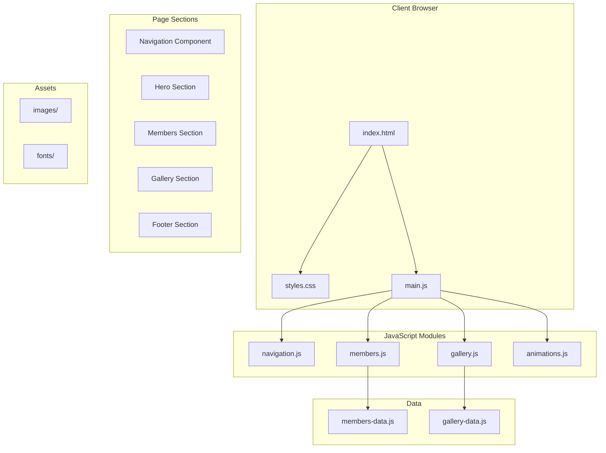

# Design Document - Class Webpage

## Overview

Trang web lớp học là một single-page application (SPA) tĩnh được xây dựng bằng HTML5, CSS3 và JavaScript thuần túy (Vanilla JS). Trang web sử dụng kiến trúc component-based với các section riêng biệt, được triển khai trên GitHub Pages. Thiết kế tập trung vào trải nghiệm người dùng mượt mà, giao diện hiện đại và tối ưu cho mobile-first.

## Architecture



### File Structure

```
class-webpage/
├── index.html              # Main HTML file
├── css/
│   ├── styles.css          # Main stylesheet
│   ├── variables.css       # CSS custom properties
│   ├── components.css      # Component styles
│   └── responsive.css      # Media queries
├── js/
│   ├── main.js             # Entry point
│   ├── navigation.js       # Navigation logic
│   ├── gallery.js          # Gallery & lightbox
│   ├── members.js          # Members grid & modal
│   ├── animations.js       # Scroll animations
│   └── data/
│       ├── members-data.js # Member information
│       └── gallery-data.js # Gallery images data
├── images/
│   ├── hero/               # Hero section images
│   ├── members/            # Member photos
│   └── gallery/            # Gallery photos
└── README.md
```

## Components and Interfaces

### 1. Navigation Component

```javascript
// Interface: NavigationController
{
  init(): void                    // Initialize navigation
  toggleMobileMenu(): void        // Toggle hamburger menu
  setActiveLink(sectionId): void  // Highlight active nav link
  scrollToSection(sectionId): void // Smooth scroll to section
}
```

**Behavior:**
- Sticky header với backdrop blur effect
- Hamburger menu trên mobile với slide-in animation
- Active link highlighting dựa trên scroll position
- Smooth scroll khi click nav links

### 2. Hero Section Component

```javascript
// Interface: HeroSection
{
  render(): HTMLElement           // Render hero content
  animateOnLoad(): void           // Entry animations
}
```

**Behavior:**
- Full-width gradient background
- Class name, school year, welcome message
- Representative class photo với overlay
- Call-to-action buttons

### 3. Members Component

```javascript
// Interface: MembersController
{
  init(): void                    // Initialize members grid
  renderGrid(members): void       // Render member cards
  sortMembers(members): Member[]  // Sort alphabetically
  openModal(memberId): void       // Open member detail modal
  closeModal(): void              // Close modal
}

// Interface: Member
{
  id: string
  name: string
  nickname: string
  photo: string
  role: string                    // Optional: Lớp trưởng, etc.
  birthday: string
  contact: {
    email: string
    phone: string
    facebook: string
  }
}
```

**Behavior:**
- Responsive grid (1/2/3-4 columns)
- Card với hover lift effect
- Modal popup cho chi tiết thành viên
- Alphabetical sorting by name

### 4. Gallery Component

```javascript
// Interface: GalleryController
{
  init(): void                    // Initialize gallery
  renderGallery(images): void     // Render image grid
  openLightbox(imageId): void     // Open lightbox
  closeLightbox(): void           // Close lightbox
  navigateLightbox(direction): void // Next/prev image
  handleSwipe(direction): void    // Mobile swipe handling
}

// Interface: GalleryImage
{
  id: string
  src: string
  thumbnail: string
  caption: string
  event: string                   // Event name
  date: string                    // Date taken
}

// Interface: GalleryEvent
{
  name: string
  date: string
  images: GalleryImage[]
}
```

**Behavior:**
- Images grouped by event
- Responsive masonry-style grid
- Lightbox với navigation controls
- Keyboard navigation (arrows, Escape)
- Touch swipe support on mobile
- Lazy loading for performance

### 5. Animations Controller

```javascript
// Interface: AnimationsController
{
  init(): void                    // Setup Intersection Observer
  observeElements(): void         // Watch elements for scroll
  animateElement(el): void        // Apply animation class
}
```

**Behavior:**
- Intersection Observer API cho scroll animations
- Fade-in và slide-up effects
- Staggered animations cho grid items

## Data Models

### Member Data Structure

```javascript
const membersData = [
  {
    id: "member-001",
    name: "Nguyễn Văn A",
    nickname: "A",
    photo: "images/members/nguyen-van-a.jpg",
    role: "Lớp trưởng",
    birthday: "15/03/2000",
    contact: {
      email: "nguyenvana@email.com",
      phone: "0901234567",
      facebook: "facebook.com/nguyenvana"
    }
  },
  // ... more members
];
```

### Gallery Data Structure

```javascript
const galleryData = [
  {
    name: "Khai giảng 2023",
    date: "05/09/2023",
    images: [
      {
        id: "img-001",
        src: "images/gallery/khai-giang-2023/full/img1.jpg",
        thumbnail: "images/gallery/khai-giang-2023/thumb/img1.jpg",
        caption: "Lễ khai giảng năm học mới"
      },
      // ... more images
    ]
  },
  // ... more events
];
```

### CSS Variables (Design Tokens)

```css
:root {
  /* Colors - Warm, friendly palette */
  --color-primary: #4F46E5;       /* Indigo */
  --color-primary-light: #818CF8;
  --color-primary-dark: #3730A3;
  --color-secondary: #F59E0B;     /* Amber accent */
  --color-background: #FAFAFA;
  --color-surface: #FFFFFF;
  --color-text: #1F2937;
  --color-text-light: #6B7280;
  
  /* Typography */
  --font-family: 'Inter', 'Segoe UI', sans-serif;
  --font-size-base: 16px;
  --font-size-lg: 1.125rem;
  --font-size-xl: 1.5rem;
  --font-size-2xl: 2rem;
  --font-size-3xl: 3rem;
  
  /* Spacing */
  --spacing-xs: 0.25rem;
  --spacing-sm: 0.5rem;
  --spacing-md: 1rem;
  --spacing-lg: 1.5rem;
  --spacing-xl: 2rem;
  --spacing-2xl: 4rem;
  
  /* Effects */
  --shadow-sm: 0 1px 2px rgba(0,0,0,0.05);
  --shadow-md: 0 4px 6px rgba(0,0,0,0.1);
  --shadow-lg: 0 10px 15px rgba(0,0,0,0.1);
  --radius-sm: 0.375rem;
  --radius-md: 0.5rem;
  --radius-lg: 1rem;
  --transition-fast: 150ms ease;
  --transition-normal: 300ms ease;
}
```


## Correctness Properties

*A property is a characteristic or behavior that should hold true across all valid executions of a system-essentially, a formal statement about what the system should do. Properties serve as the bridge between human-readable specifications and machine-verifiable correctness guarantees.*

Based on the acceptance criteria analysis, the following properties must hold:

### Property 1: Member Grid Completeness and Content
*For any* array of member data, when rendered to the members grid, the number of member cards displayed SHALL equal the length of the input array, AND each card SHALL contain the member's photo, name, and role (if present).
**Validates: Requirements 2.1, 2.2**

### Property 2: Member Sorting Correctness
*For any* array of members, after sorting, for every pair of adjacent members (member[i], member[i+1]), the name of member[i] SHALL be alphabetically less than or equal to the name of member[i+1] using Vietnamese locale comparison.
**Validates: Requirements 2.4**

### Property 3: Member Modal Content Completeness
*For any* member object, when the member modal is opened, the modal SHALL display all detail fields: nickname, birthday, and contact information that exist in the member data.
**Validates: Requirements 2.3**

### Property 4: Gallery Event Grouping and Thumbnail Rendering
*For any* gallery data with events, when rendered, each event SHALL have a visible header, AND the number of thumbnail images under each event SHALL equal the number of images in that event's data array.
**Validates: Requirements 3.1, 3.2**

### Property 5: Lightbox Content Correctness
*For any* gallery image, when clicked to open the lightbox, the lightbox SHALL display the full-size image source AND the caption matching the clicked image's data.
**Validates: Requirements 3.3**

### Property 6: Navigation Active State Correctness
*For any* scroll position that falls within a section's boundaries, the navigation link corresponding to that section SHALL have the active class applied, AND no other navigation links SHALL have the active class.
**Validates: Requirements 5.4**

### Property 7: Asset Path Relativity
*For any* asset reference (images, scripts, stylesheets) in the HTML, CSS, or JavaScript files, the path SHALL be relative (not starting with "/" or "http").
**Validates: Requirements 7.1**

### Property 8: Image Lazy Loading
*For any* img element in the gallery section, the element SHALL have the loading="lazy" attribute set.
**Validates: Requirements 7.4**

## Error Handling

### Image Loading Errors
- Display placeholder image when member photo fails to load
- Show "Image not available" message in gallery for failed thumbnails
- Graceful degradation: page remains functional even if images fail

### Data Validation
- Handle missing optional fields (role, contact info) gracefully
- Display "Không có thông tin" for missing data fields
- Validate data structure on initialization

### Navigation Errors
- Fallback to page reload if smooth scroll fails
- Handle missing section IDs gracefully
- Default to first section if target not found

### Lightbox Errors
- Close lightbox if image fails to load
- Disable navigation if at first/last image
- Handle touch events gracefully on non-touch devices

### Browser Compatibility
- Feature detection for Intersection Observer
- Fallback for browsers without CSS custom properties
- Graceful degradation for older browsers

## Testing Strategy

### Unit Testing Framework
Sử dụng **Jest** với **jsdom** cho unit testing JavaScript modules.

### Property-Based Testing Framework
Sử dụng **fast-check** library cho property-based testing trong JavaScript.

```javascript
// Example property test setup
import fc from 'fast-check';
import { sortMembers } from './members.js';

// Property test annotation format:
// **Feature: class-webpage, Property 2: Member Sorting Correctness**
```

### Test Categories

#### 1. Unit Tests
- Navigation toggle functionality
- Member sorting function
- Gallery lightbox open/close
- Active link calculation
- Data validation functions

#### 2. Property-Based Tests
Mỗi correctness property sẽ được implement bằng một property-based test riêng biệt:

- **Property 1**: Generate random member arrays, verify grid rendering completeness
- **Property 2**: Generate random member arrays, verify sorting order
- **Property 3**: Generate random member objects, verify modal content
- **Property 4**: Generate random gallery events, verify grouping and thumbnails
- **Property 5**: Generate random images, verify lightbox content
- **Property 6**: Generate random scroll positions, verify active nav state
- **Property 7**: Scan all asset paths, verify relativity
- **Property 8**: Scan all gallery images, verify lazy loading attribute

#### 3. Integration Tests
- Full page load and navigation flow
- Member card click to modal flow
- Gallery thumbnail to lightbox flow

### Test Configuration
- Minimum 100 iterations per property-based test
- Each property test tagged with: `**Feature: class-webpage, Property {number}: {property_text}**`
- Tests run via `npm test` command

### Test File Structure
```
tests/
├── unit/
│   ├── navigation.test.js
│   ├── members.test.js
│   └── gallery.test.js
├── properties/
│   ├── members.property.test.js
│   └── gallery.property.test.js
└── setup.js
```
